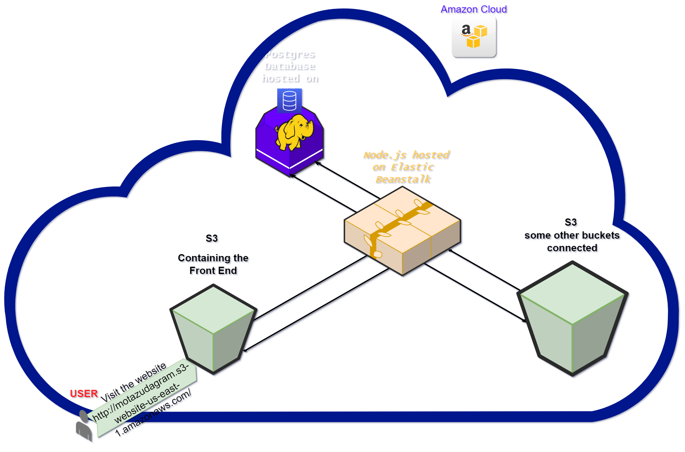

# Hosting a Full-Stack Application

 

## Table of Contents

* [Summary](#Summary)
* [AWS services used](#AWS-services-used)
* [Architecture diagram](#Architecture-diagram)
* [CircleCI pipeline steps](#CircleCI-pipeline-steps)
## Summary

In this project **udagram** we deploy Full-Stack application to AWS cloud service provider so that it is available to customers can be access the app by visiting http://motazudagram.s3-website-us-east-1.amazonaws.com    

we used the aws console to start and configure the services as screenshoots in the **(documentation folder)**.

the application needs postgress database hosted on RDS to store user and post information and a web server allowing the site to be discovered by potential customers.

## AWS services used

| Technology    |  Usage       |
| -----------   | ------------ |
|**Elastic Beanstalk**    |hosting the back end          |
|**S3**         |hosting the front end           |
|**RDS**        |used to host postgres database

## Architecture diagram      

in the following diagram you will find the  infrastructure needs (RDS, S3 Elastic Beanstalk) for the forntend, backend and postgress databas
 
  

  

            
# CircleCI pipeline steps
configuration file of circleci can be found in **".circleci/config.yml"**
scripts is outlined in root level **package.json**

  

  

